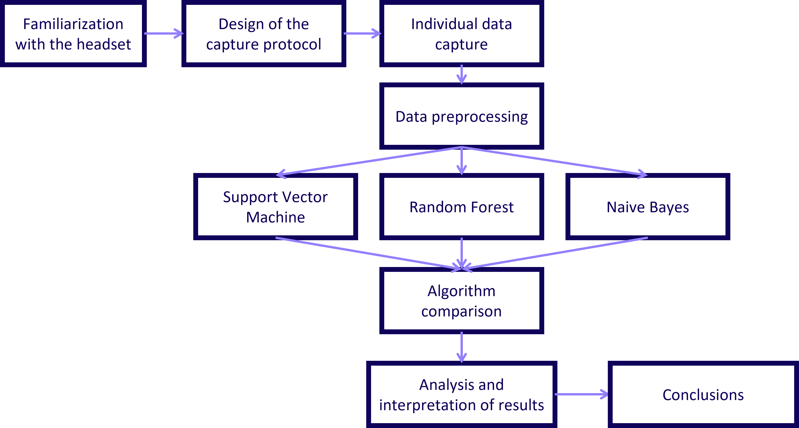
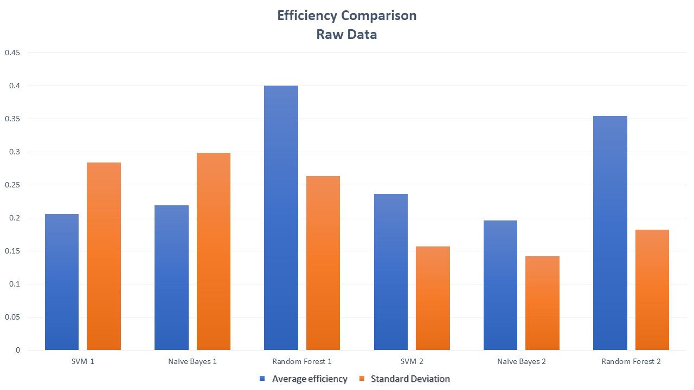
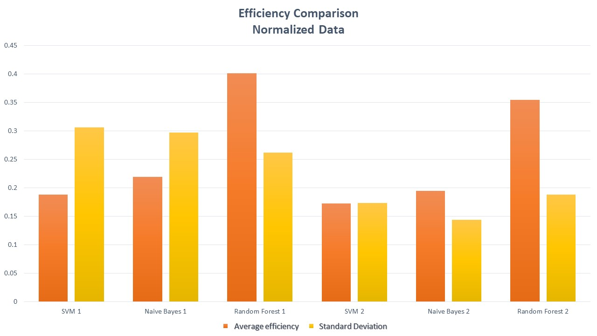
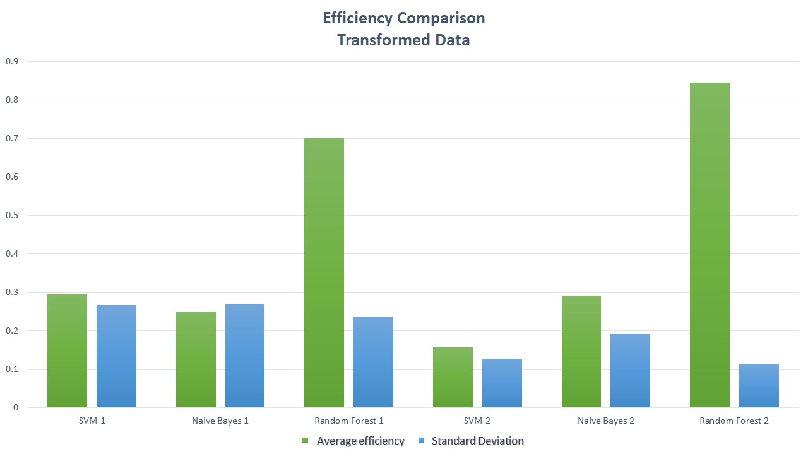
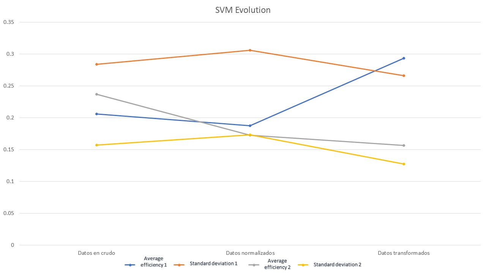
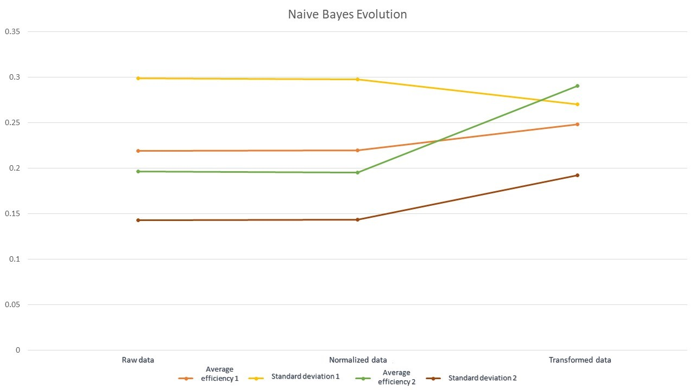
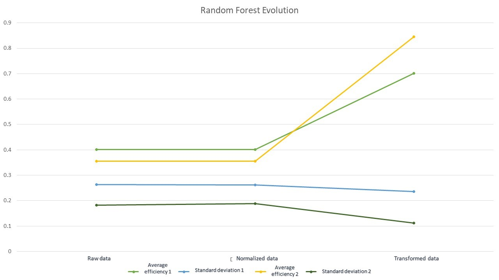
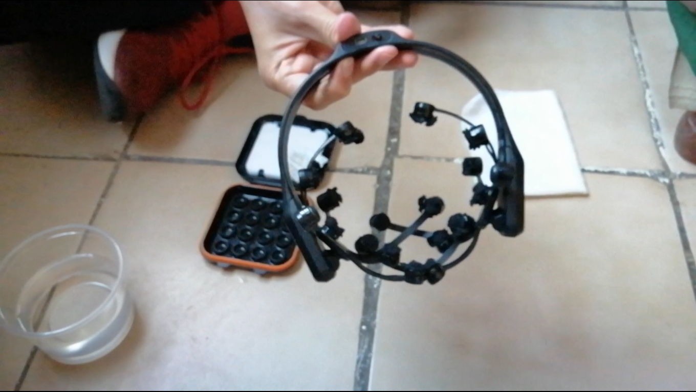

# UAA-ICI-Thesis
Undergraduate thesis repository of my career ICI studied at the UAA

---

**Abstract:**

Brain-computer interfaces enable a new direct communication channel between brain and machine. In order to interpret thoughts as movement intentions, tools such as electroencephalograms (EEGs) are used to collect brain activity. The interpretation of this data requires computationally effective artificial intelligence algorithms.

The objective of this research is to compare support vector machine, random forest, and naive Bayes models to identify the model that efficiently classifies data obtained from an Emotiv Epoc+ headset regarding movement intention. These models were evaluated based on the raw datasets (as received from the experimentation) and the datasets after applying normalization and transformation. In general, the efficiency of support vector machine and naive Bayes does not exceed precision percentages of 50%, while random forest significantly improves with each evolution of the data, achieving efficiency values above 80%. This investigation provides a detailed description of the procedure performed to achieve these results.

**Key words:**

- Brain - computer interface
- Movement intention
- Machine Learning
- Support Vector Machine
- Naive Bayes
- Random Forest

---

## Table of contents

- [Problem statement](#problem-statement)
- [Justification](#justification)
- [Objectives](#objectives)
- [Theoretical background](#theoretical-background)
- [Methodology](#methodology)
- [Development](#development)
- [Audiovisual evidences](#audiovisual-evidences)
- [Conclusions](#conclusions)
- [References](#references)

---

### Problem statement

The problem of this research lies in the use of computer equipment, especially the difficulties faced by individuals with disabilities in controlling these computational devices. However, BCIs facilitate their use (Marte, 2019).

The issue is that implementing a BCI also involves the use of artificial intelligence. Additionally, this field of machine learning has developed numerous algorithms. In this research, we ask which model is the best among support vector machine, naive Bayes, and random forest.

---

### Justification

From a social perspective, we have a justification where it is known that 16% of the population has a significant disability (WHO, 2023), and the National Institutes of Health (2019) states that BCIs enable improved functioning. Thus, the idea of enhancing computer interaction through a BCI is established. Therefore, this research justifies its execution due to the inclusion of computer usage by individuals with significant disabilities.

From a computational perspective, the question revolves around: Which algorithm performs better classification? Comparing SVM, Random Forest, and Naive Bayes for the classification of movement intention to operate a computer.

---

### Objectives

The general objective of this research is the following:

>Compare support vector machine, random forest, and naive Bayes to identify the model that classifies data obtained from an Emotiv Epoc+ headset on movement intention with greater efficiency.

Specific objectives were established to help achieve the general objective:

1. Establish an efficient connection between the Emotiv Epoc+ device and a computer system that allows extracting user's neuronal activity data.
2. Adapt the necessary tools, such as the Python program developed by CymatiCorp: CyKit, the OpenViBE program, and the Emotiv software, to ensure correct reception of data from the device acting as an EEG.
3. Perform preprocessing of the obtained data to improve the performance of the machine learning models.
4. Implement the support vector machine, random forest, and naive Bayes algorithms to conduct learning tests on the brain activity data.
5. Analyze which of the aforementioned models classifies the brain activity of the test subject in movement intention with greater efficiency.

---

### Theoretical background

The theoretical background addresses topics from the following fields:

1. Introduction to neuroanatomy
2. Electroencephalography and brain studies
3. Computational fundamentals, artificial intelligence, and machine learning
4. The mental processes of this research: Imagined speech, concept evocation, and movement intention

For more information, the document provides further details on each specific topic.

---

### Methodology

In terms of material, the following aspects were required:

- Windows 11 computer
- Python 3.10
- Emotiv version 1809 for Windows
- CyKit version 3.0
- OpenViBE version 2.7.2 for 64-bit
- Emotiv Epoc+

In addition, some volunteers were needed for the field experimentation. There were a total of 27 test subjects, with 21 of them being between the ages of 18 and 30. Six of them were 30 years or older. Furthermore, it is emphasized that out of the 27 subjects, 11 were female and 16 were male.

The following graph shows the methodology used in this investigation:

---

### Development

The data capture, evidence from field experimentation, and a detailed description of the results are found in the attached document. To avoid further increasing the size of this repository introduction, only the result graphs obtained from the procedure of this research are included.

The following are the average efficiency results along with the dispersion obtained by each model in each stage of the experimentation: using raw data, normalized data, and transformed data.

Next, the results of the evolution of each model at each stage of the field experimentation are presented.

---

### Audiovisual evidences

---

### Conclusions

In conclusion, it is noteworthy that the objectives were successfully achieved, observing that random forest is the algorithm with the best performance in this specific problem.

Furthermore, there is much future work that can be done, such as exploring more algorithms, seeking additional data processing techniques, conducting real-time evaluations of this experiment, or continuing the implementation using random forest in a BCI.

It is worth mentioning that some of the successes of the research were the good familiarization with the headset, the social willingness to participate in the test (thanks to all the volunteers for participating <3), and the chosen data preprocessing.

As areas for improvement, further experimentation could be conducted to better define the mental task and to standardize the testing environment.

---

### References

References are included in the document as there are too many to list them here.